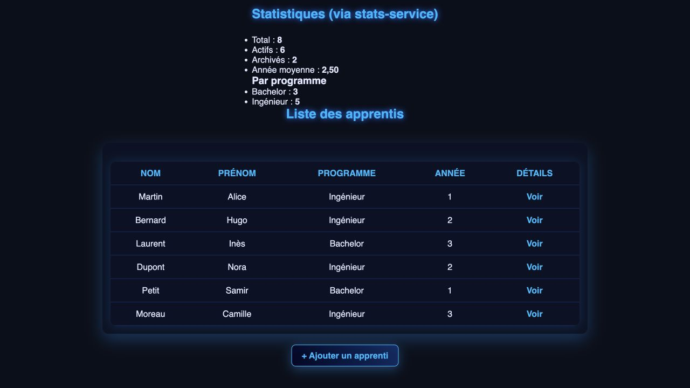
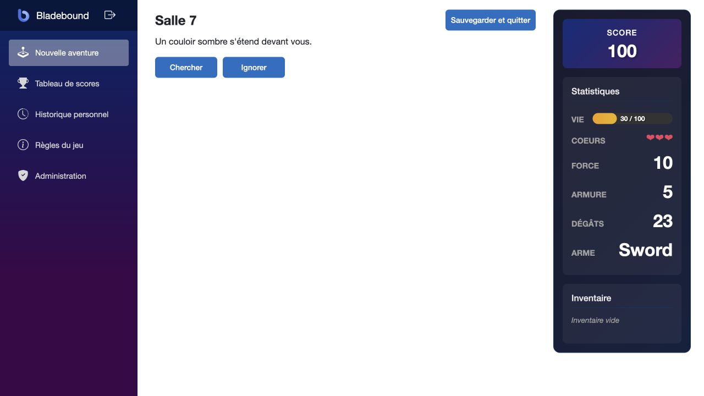
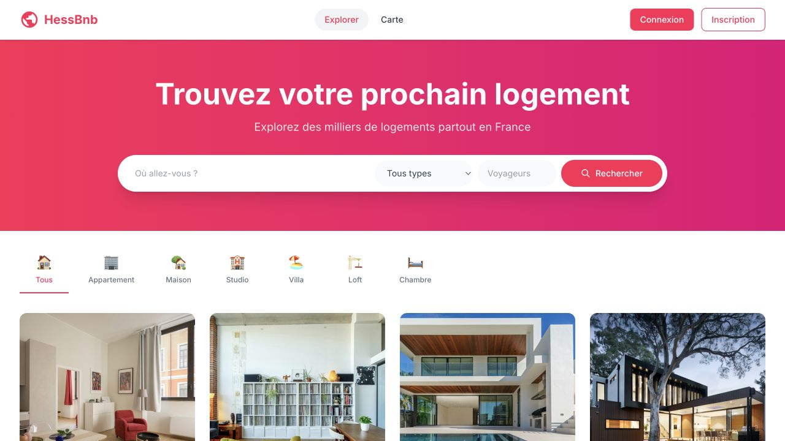

# El Hadj Sylla

**Java backend & full-stack · Software engineering apprentice at SFR · EFREI Paris, class of 2027**

I’m looking for a **three-month internship abroad, starting in March 2027**. Open to destinations worldwide. English C1 · TOEIC 910.

[Portfolio & CV](https://el-hadj-sylla-cv.vercel.app/en/) · [LinkedIn](https://www.linkedin.com/in/elhadj-sylla) · [Contact](mailto:syllaelhadj2003@icloud.com)

## Making existing projects easier to change

My dissertation focused on **technical debt**. I revisited these academic team projects to apply maintainability principles to existing code: separate responsibilities, protect behaviour with regression tests and document the decisions that still need work. The original contributors and history are preserved.

Real application screenshots from local runs with fictional sample data. Select a preview to read the case study on my CV website.

| myFSS | BlazorGameQuest | HessBnb |
| --- | --- | --- |
|  |  |  |

| Project | What changed | Evidence |
| --- | --- | --- |
| **[myFSS](https://github.com/hadjfn/devops-projet-efrei)** · Java / Spring Boot | Archiving now commits to the database. Controllers use application services; a statistics outage is shown as unavailable instead of zero records. | [Changes](https://github.com/hadjfn/devops-projet-efrei/compare/8866fa6...d89fb66) · [Architecture](https://github.com/hadjfn/devops-projet-efrei/blob/main/docs/architecture.md) · [CI](https://github.com/hadjfn/devops-projet-efrei/actions) |
| **[BlazorGameQuest](https://github.com/hadjfn/blazor-gamequest)** · C# / Blazor | Session use cases enforce ownership and lifecycle rules. A sequential victory retry cannot award the bonus again, and actions use the session’s own character. | [Changes](https://github.com/hadjfn/blazor-gamequest/compare/f655628...3a66cb3) · [Architecture](https://github.com/hadjfn/blazor-gamequest/blob/main/docs/architecture.md) · [CI](https://github.com/hadjfn/blazor-gamequest/actions) |
| **[HessBnb](https://github.com/hadjfn/hessbnb)** · Spring Boot / Angular | Booking rules are separated from delivery code. PostgreSQL prevents overlapping active stays; an outbox records events in the booking transaction, with rental deduplication. | [Changes](https://github.com/hadjfn/hessbnb/compare/6530f1c...db19427) · [Architecture](https://github.com/hadjfn/hessbnb/blob/main/docs/architecture.md) · [CI](https://github.com/hadjfn/hessbnb/actions) |

The verified suites run **59 tests for myFSS**, **243 for BlazorGameQuest**, and **33 Java + 4 Angular tests for HessBnb**. Each repository includes regression tests, architecture checks and a debt register.

Remaining work is explicit: PostgreSQL integration tests for myFSS, durable storage and broader ownership checks for BlazorGameQuest, and server-side price validation plus real broker recovery tests for HessBnb.

[Read the before/after engineering notes in French →](docs/maintenabilite.md)

## What I work on

At **SFR / Altice France**, I work with Java / Spring Boot and Angular, migrations from stored procedures to JPA, SQL optimisation and CI/CD tasks. I also audit applications for clean code and maintainability. I’m interested in SOLID principles and test-driven development where they help clarify business rules and make changes safer.

## Also built

**[Wooka Esport — jersey store](https://wooka-shop.vercel.app/)**: a personal e-commerce project, converting the Wooka store into an application with Stripe payment integration.

Academic background and original contributions

- **myFSS:** EFREI DevOps project with Lucas Faria. The [collaborative version](https://github.com/hadjfn/myFSS_Devops) is the academic base for my personal continuation.
- **BlazorGameQuest:** [original project with Lucas Faria](https://github.com/lucasfariafr/BlazorGameQuest). My contributions included game actions and sessions, interface screens, score history, role checks and xUnit tests.
- **HessBnb:** [original team project](https://github.com/lfleury78/ALIF82-2526PSP01_Projet_Microservices). I contributed the initial MySQL schema, indexes and constraints, Docker database setup and sample data. The team later moved to PostgreSQL.
- Earlier exercises: [Spring Boot CI](https://github.com/hadjfn/tp1_devops) and [C/CMake automation](https://github.com/hadjfn/Atelier_CMAKE_SYLLA), the latter based on OpenRSI coursework.

Outside software: grappling at MMA Factory, climbing, strength training and esports.
