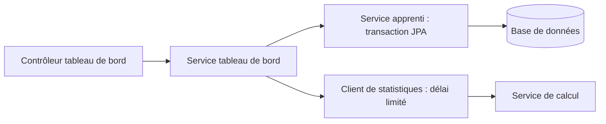
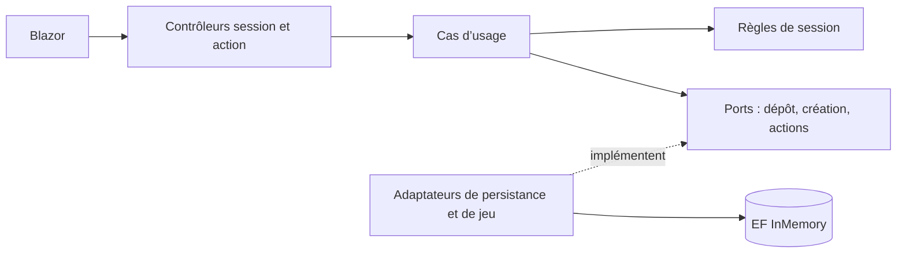
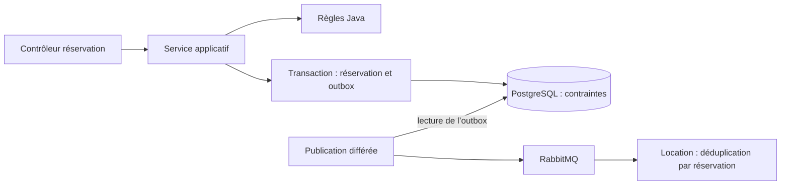

# Trois refontes pour mieux maîtriser les changements

Ces travaux prolongent des projets scolaires réalisés en équipe. Les versions personnelles conservent l’historique et les auteurs d’origine. Mon objectif est de corriger des comportements fragiles, clarifier les responsabilités et laisser des preuves vérifiables dans les tests. Les schémas ci-dessous montrent les parties retravaillées, pas tous les composants des applications.

## myFSS — transactions et tableau de bord

**Avant.** L’archivage modifiait un objet hors transaction ; son test unitaire ne vérifiait pas la persistance réelle. Le contrôleur chargeait aussi cinq ensembles de données inutilisés. Deux routes de tableau de bord produisaient des modèles différents, et un échec du service de statistiques devenait un résumé à zéro.

**Changement.** Le service apprenti possède les transactions. L’édition conserve l’état archivé et un identifiant inexistant ne crée pas une nouvelle ligne. Le service de tableau de bord consulte un jeu de données puis appelle les statistiques après la fermeture de la transaction. Les contrôleurs ne connaissent ni les dépôts ni le client HTTP. Une absence de statistiques est affichée explicitement ; les erreurs et la suppression POST sont testées.

**Bénéfice.** On peut modifier l’affichage sans déplacer les règles de persistance, et une panne distante ne transforme pas une liste existante en faux compteurs nuls. Le test d’archivage relit les données après commit, au lieu de vérifier seulement un objet en mémoire.

**Preuves :** [diff de la refonte](https://github.com/hadjfn/devops-projet-efrei/compare/8866fa6...d89fb66) · [architecture](https://github.com/hadjfn/devops-projet-efrei/blob/main/docs/architecture.md) · [décision](https://github.com/hadjfn/devops-projet-efrei/blob/main/docs/adr/001-application-boundaries.md) · [tests de persistance](https://github.com/hadjfn/devops-projet-efrei/blob/main/apprenti-service/src/test/java/faria/sasikumar/sylla/myfss/service/ApprentiPersistenceTest.java) · [tests HTTP](https://github.com/hadjfn/devops-projet-efrei/blob/main/apprenti-service/src/test/java/faria/sasikumar/sylla/myfss/client/StatsClientTest.java).

**Limite.** Les 59 tests couvrent les deux services, mais la persistance est testée sur H2. La compatibilité PostgreSQL, les migrations et une authentification réelle restent à traiter dans le [journal de dette](https://github.com/hadjfn/devops-projet-efrei/blob/main/docs/technical-debt.md).

## BlazorGameQuest — règles de session et propriété des données

**Avant.** Des services concrets concentraient l’orchestration et la persistance. Les accès aux sessions, les sauvegardes et les transitions finales n’étaient pas suffisamment protégés : une victoire pouvait créditer à nouveau un bonus, et une action pouvait sélectionner le premier personnage de l’utilisateur plutôt que celui de la session.

**Changement.** Les cas d’usage de session et d’action vérifient le propriétaire et l’état avant d’agir. Les règles de cycle de vie sont séparées de HTTP et de la base ; le temps est fourni explicitement. Des ports ciblés donnent accès au dépôt, à la création et aux actions sans exposer `DbSet` ou `IQueryable`. Les contrôleurs traduisent l’identité et les résultats en réponses HTTP.

**Bénéfice.** Les transitions refusées deviennent testables sans interface graphique. Les tests HTTP vérifient aussi la différence entre propriétaire et autre utilisateur. La logique de session peut évoluer sans répartir ses contrôles dans plusieurs écrans.

**Preuves :** [diff de la refonte](https://github.com/hadjfn/blazor-gamequest/compare/f655628...3a66cb3) · [architecture](https://github.com/hadjfn/blazor-gamequest/blob/main/docs/architecture.md) · [décisions](https://github.com/hadjfn/blazor-gamequest/blob/main/docs/decisions.md) · [règles testées](https://github.com/hadjfn/blazor-gamequest/blob/main/BlazorGame.Tests/Tests/Rules/SessionRulesTests.cs) · [tests HTTP](https://github.com/hadjfn/blazor-gamequest/blob/main/BlazorGame.Tests/Tests/Integration/GameSessionApiTests.cs) · [contrôles de dépendances](https://github.com/hadjfn/blazor-gamequest/blob/main/BlazorGame.Tests/Tests/Architecture/DependencyTests.cs).

**Limite.** La suite compte 243 tests. Les combats et la génération restent en partie couplés à EF ; InMemory ne garantit ni durabilité ni concurrence. L’idempotence de victoire couvre une répétition séquentielle, pas deux requêtes simultanées. Les autres endpoints ne sont pas tous couverts par la nouvelle frontière de propriété : [dette restante](https://github.com/hadjfn/blazor-gamequest/blob/main/docs/technical-debt.md).

## HessBnb — cohérence des réservations et des événements

**Avant.** La vérification d’un chevauchement précédait l’insertion, sans empêcher deux requêtes concurrentes de passer ensemble. Les événements étaient envoyés avant le commit. Le consommateur de locations masquait des erreurs de persistance et supportait mal les confirmations répétées.

**Changement.** Les règles de réservation sont extraites en Java sans framework. Une contrainte PostgreSQL protège les dates actives, avec verrouillage optimiste sur l’état. La réservation et l’événement outbox sont écrits dans une même transaction ; un composant séparé publie ensuite vers RabbitMQ. La création de location déduplique les confirmations sur l’identifiant de réservation.

**Bénéfice.** Une panne du broker ne fait pas perdre l’intention de publier après l’enregistrement d’une réservation. Les contraintes couvrent aussi les conflits concurrents, au-delà de la vérification applicative. La livraison reste « au moins une fois » : les doublons sont une possibilité prévue, pas une promesse d’envoi unique.

**Preuves :** [diff de la refonte](https://github.com/hadjfn/hessbnb/compare/6530f1c...db19427) · [architecture](https://github.com/hadjfn/hessbnb/blob/main/docs/architecture.md) · [décision](https://github.com/hadjfn/hessbnb/blob/main/docs/adr/0001-booking-consistency.md) · [tests réservation/PostgreSQL](https://github.com/hadjfn/hessbnb/blob/main/services/booking-service/src/test/java/fr/efrei/bookingservice/BookingReliabilityIT.java) · [tests de déduplication](https://github.com/hadjfn/hessbnb/blob/main/services/rental-service/src/test/java/fr/efrei/rentalservice/RentalIdempotencyIT.java) · [tests Angular](https://github.com/hadjfn/hessbnb/blob/main/app/frontend/src/app/core/guards/auth.guard.spec.ts).

**Limite.** Les vérifications portent sur 33 tests Java et 4 tests Angular ; les intégrations de réservation utilisent un vrai PostgreSQL via Testcontainers, mais simulent le broker. Le prix et le propriétaire reçus du client doivent encore être vérifiés auprès d’une source serveur fiable. La reprise réelle de RabbitMQ et l’autorisation des autres services restent dans le [journal de dette](https://github.com/hadjfn/hessbnb/blob/main/docs/technical-debt.md).

## Lire les preuves sans surinterpréter les chiffres

Les nombres correspondent à des suites de périmètres différents, pas à un classement entre projets. Les [CI myFSS](https://github.com/hadjfn/devops-projet-efrei/actions), [BlazorGameQuest](https://github.com/hadjfn/blazor-gamequest/actions) et [HessBnb](https://github.com/hadjfn/hessbnb/actions) permettent de vérifier les exécutions suivantes. Les liens de comparaison isolent les refontes personnelles ; les README des projets précisent les contributions initiales.

Les aperçus du [profil](../README.md#application-previews) proviennent d’exécutions locales réelles avec des données fictives. Une capture montre une interface ; les tests et le code apportent les preuves sur les comportements décrits ici.
